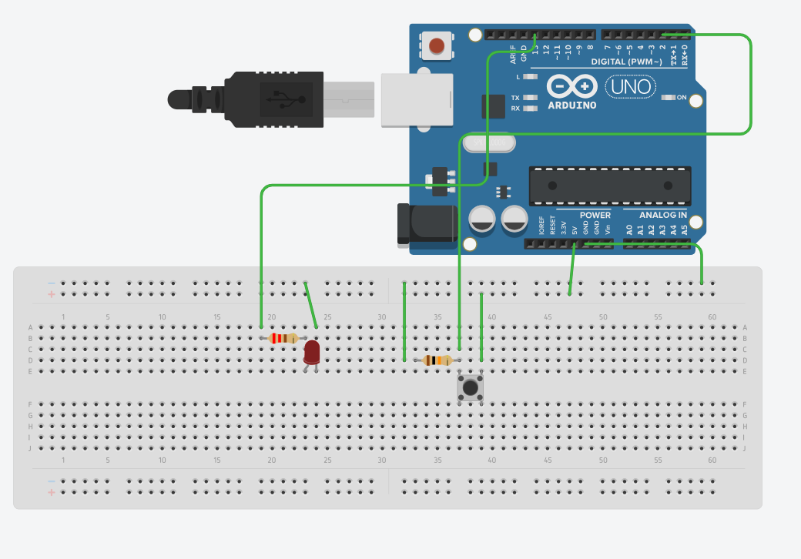
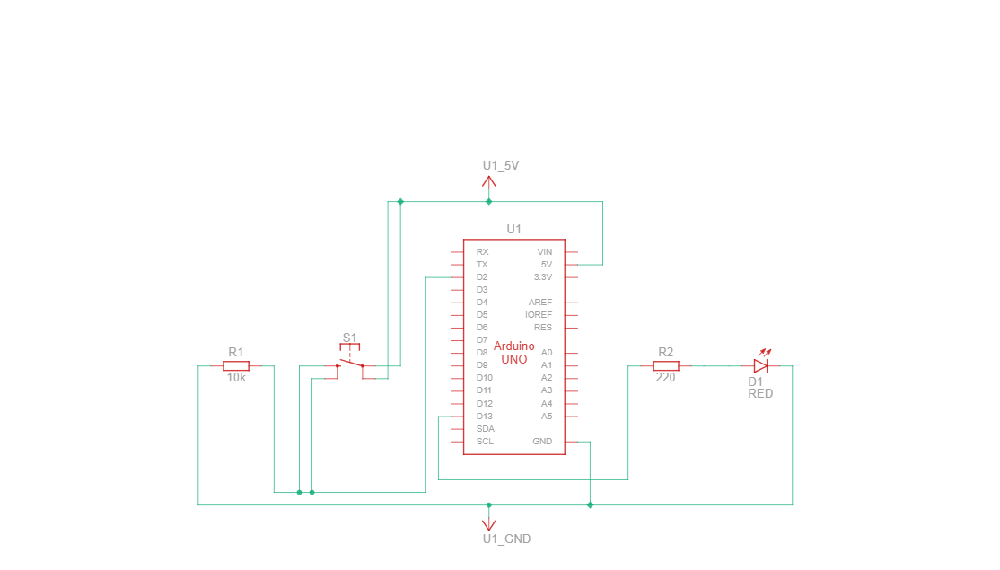

# Ardino Pushbutton Led Control
A simple Arduino project demonstrating LED control using a pushbutton input.

## 🎯 Introduction / Objective
This project demonstrates the **basic concept of digital input and output** using an Arduino.  
When the pushbutton is pressed, the LED turns **ON**, and when released, the LED turns **OFF**.  
It’s a simple yet fundamental project to understand **how Arduino reads input signals and controls output devices**.

---

## ⚙️ Components Used
| Component | Quantity | Description |
|------------|-----------|-------------|
| Arduino UNO | 1 | Microcontroller board used to run the code |
| Breadboard | 1 | For connecting the circuit without soldering |
| LED (any color) | 1 | Visual output indicator |
| Pushbutton | 1 | Input device to control the LED |
| Resistor 220Ω| 1 | Limits current to the LED |
| Resistor 10kΩ | 1 | Used as a pull-down resistor for the button |
| Jumper Wires | As needed | For making connections |

> 💡 **Note:** In my prototype, I used a 10 kΩ resistor for the LED because I didn’t have a 220 Ω one available.  
> The LED still worked but was very dim. Recommended value: **220 Ω**.


## 🔌 Circuit Diagram / Wiring

**Connections:**
- **Digital Pin 13** → **Resistor (220Ω)** → **LED Anode (+)**  
- **LED Cathode (–)** → **GND**  
- **Pushbutton one side** → **+5V**  
- **Pushbutton other side** → **Digital Pin 2**  
- **10kΩ resistor** between **Pin 2** and **GND** (pull-down resistor)

## 🔌 Circuit Diagram / Wiring

### Breadboard View


### Schematic View


## ⚙️ How It Works

This project demonstrates how a **pushbutton switch** can be used to control an **LED** using an Arduino.

When the button is **pressed**, the circuit is **completed**, and the LED turns **ON**.  
When the button is **released**, the circuit **breaks**, and the LED turns **OFF** again.

### Step-by-Step Explanation

1. The **LED** is connected to a digital pin (e.g., **pin 13**) through a **220 Ω resistor**, which limits the current to protect the LED.  
2. The **pushbutton** is connected to another digital pin (e.g., **pin 2**).  
3. A **10 kΩ resistor** is used as a **pull-down resistor** — it keeps the button’s input **LOW (0)** when the button isn’t pressed.  
4. When the button is **pressed**, the input pin goes **HIGH (1)** because it connects to **5 V**.  
5. The Arduino code reads this signal:
   - If the input is **HIGH**, the LED is switched **ON**.  
   - If the input is **LOW**, the LED is **OFF**.  

In short:  
> 🟢 **Press button → LED ON**  
> ⚫ **Release button → LED OFF**

---

### 🧠 Additional Note

In the prototype version, a **10 kΩ resistor** was temporarily used for the LED due to component availability.  
The LED still worked but was **very dim**.  
The **recommended resistor value** for the LED is **220 Ω** for normal brightness and safe operation.

## 🔄 Simple Logic Flow
Start
│
│
Button Pressed?
├── Yes → Turn ON LED
└── No  → Turn OFF LED
│
End

## 💻 Code Explanation

```cpp
const int buttonPin = 2;    // Pushbutton pin
const int ledPin = 13;      // LED pin
int buttonState = 0;        // Variable for reading the button status

void setup() {
  pinMode(ledPin, OUTPUT);      
  pinMode(buttonPin, INPUT);    
}

void loop() {
  buttonState = digitalRead(buttonPin);  

  if (buttonState == HIGH) {      
    digitalWrite(ledPin, HIGH);   // Turn LED ON
  } else {
    digitalWrite(ledPin, LOW);    // Turn LED OFF
  }
}
```

### 🎬 Demo / Result  
[▶️ Watch Demo Video](videos/pushbuttondemo.mp4)

## 🧩 Challenges and Learning

### 🔹 Challenges Faced:
- **Understanding the pushbutton connections:**  
  Initially, it was confusing that the button has **four pins**, but only **two are needed** because each side is internally connected in pairs.  
- **Choosing the right resistor:**  
  Used **10kΩ resistors** (instead of the typical 220Ω for the LED) and learned how resistor value affects **current flow** and **LED brightness**.  
- **Circuit not working at first:**  
  The LED didn’t light up until checking the **breadboard connections** and ensuring the **button pins** were placed across the **central gap** correctly.  
- **Understanding INPUT and OUTPUT pins:**  
  Learned how Arduino differentiates between **reading a signal (INPUT)** and **sending a signal (OUTPUT)**.

---

### 🔹 What I Learned:
- How a **pushbutton switch** works internally and how it controls the circuit.  
- The importance of **pull-up or pull-down resistors** to get a stable button signal.  
- How to use **digitalRead()** and **digitalWrite()** functions in Arduino.  
- Practical understanding of **digital input/output logic** — when the button is pressed (HIGH), the LED turns ON; otherwise, it turns OFF.  
- Improved confidence in **wiring and debugging breadboard circuits**.

---

💡 *This project helped me understand how basic input/output control works in Arduino and built a strong foundation for future sensor-based projects.*

## 🚀 Next Steps / Enhancements

### 🔹 Future Improvements:
- **Add a Buzzer for Sound Feedback:**  
  Connect a buzzer alongside the LED so that when the button is pressed, both **light** and **sound** activate simultaneously for better user feedback.

- **Control Multiple LEDs:**  
  Use one or more buttons to control **multiple LEDs**, creating **interactive effects** or simple **light patterns**.

- **Integrate Serial Monitor Output:**  
  Display the **button state** (e.g., “Button Pressed” / “Button Released”) on the **Serial Monitor** for real-time observation and debugging.
